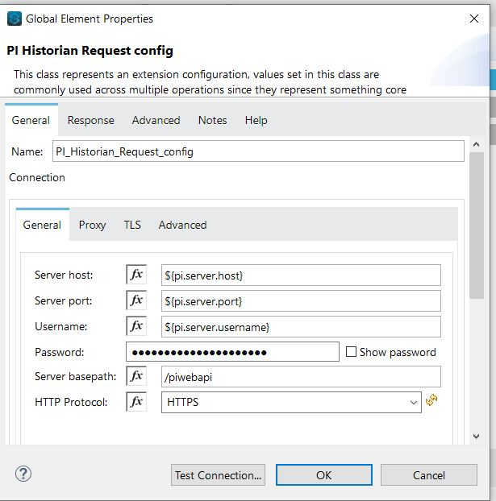
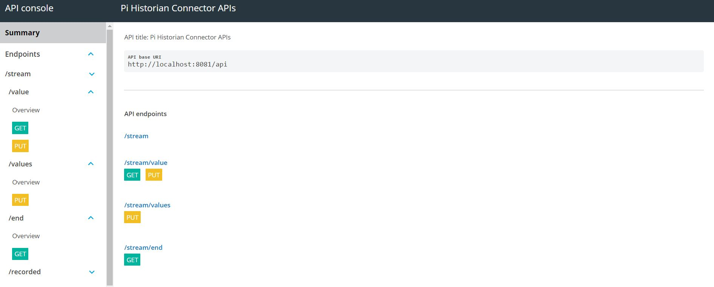
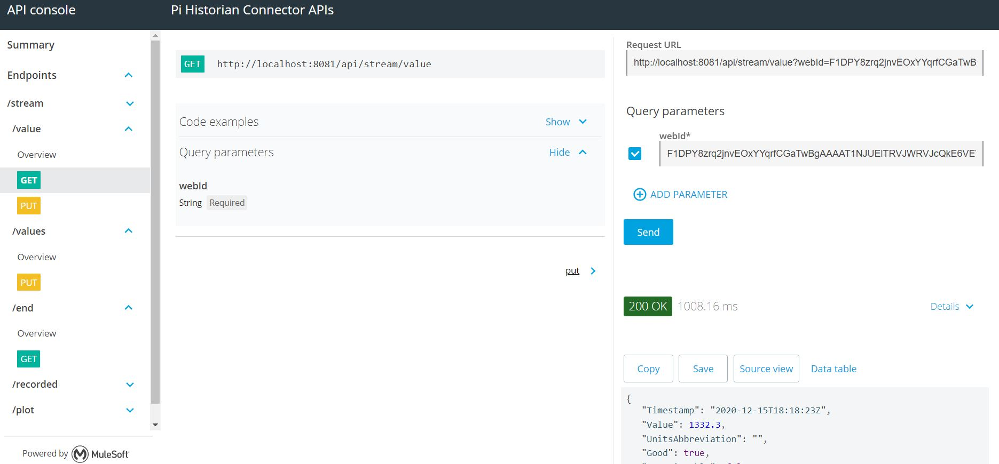
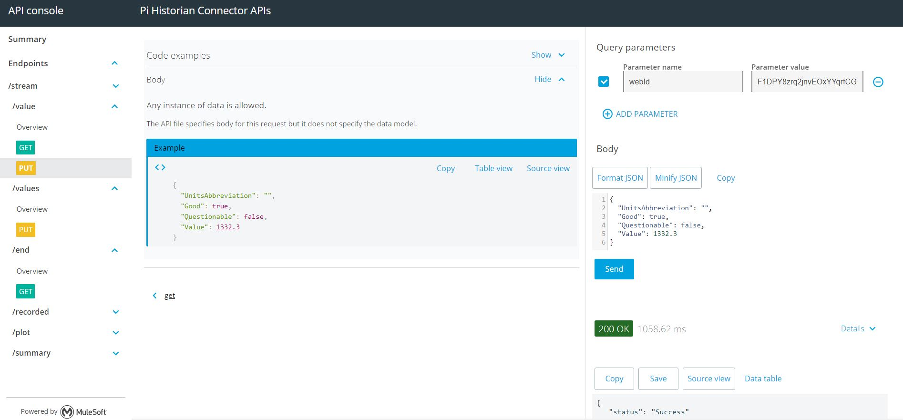

Anypoint Pi Historian Connector Demo
==================================


## INTRODUCTION
------------


* The present demo provides an application that contains sample flows which invoke the following operations related to the streams.

   * Get Stream value by WebId
   * Get Stream Summary by WebId
   * Get Recorded Stream by WebId
   * Get Plot Strean by WebId
   * Update Stream Value
   * Update Bulk Stream Values
   * Get End of Stream by WebId


## Prerequisites
In order to build and run this project, you'll need;
* Java 8
* Anypoint Studio 7.x
* Mule Runtime 4.1.x or higher
* PI Web API 2016 with Basic Auth enabled +


## Import the project

* Go to **File > Import**.
* Select **Anypoint Studio Project from File System** (under the parent folder "Anypoint Studio").
* Provide the root **path to the demo** project folder.
* Select **Mule Runtime (4.1.x EE)** or higher.
* Click **Finish**.
* Set credentials inside the file `src/main/resources/server-config.properties`.

   ```
    pi.server.username=
    pi.server.password=
    pi.server.host=
    pi.server.port=
    
   ```
   
* Open the **Global Element Configuration**.
   
   
* Click the **Test Connection** button to ensure there is connectivity with the sandbox. A successful message should pop-up.

## Run the demo

* Go to **Run > Run As > Mule Application**. 
* Open a browser and access the URL **http://localhost:8081/console/**. You should see the api console with all the endpoints.



## example-get-streams-value :

* Select the /stream/value **GET** endpoint.
* In the **webId** query parameter field, add the webId of a PI Point for which you want to retrieve the value.
* Hit send button.



## example-update-streams-value :

* Select the /stream/value **PUT** endpoint.
* Add **webId** query parameter , add the webId of a PI Point for which you want to update the value.
* Keep the body json as is or update it if you want.
* Hit send button.


  

## See more
* For additional technical information on the PiHistorian Connector, visit our [technical reference documentation](TBA).
* For more information on PiHistorian, go to the [PiWeb API site](https://techsupport.osisoft.com/Documentation/PI-Web-API/help.html).
