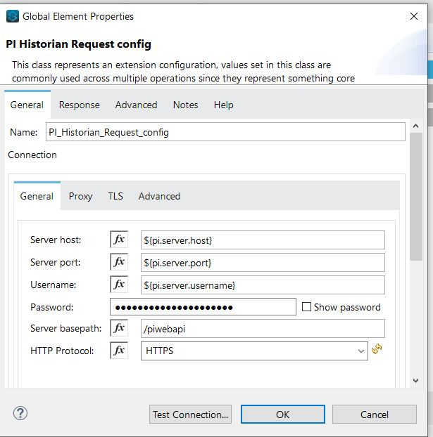
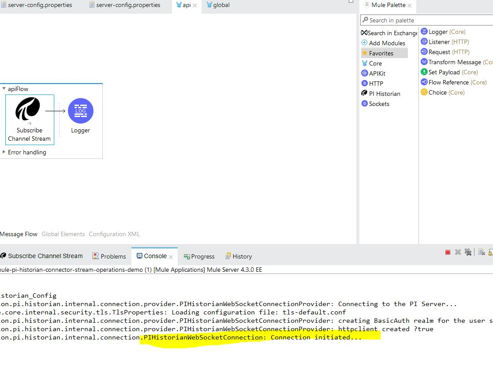
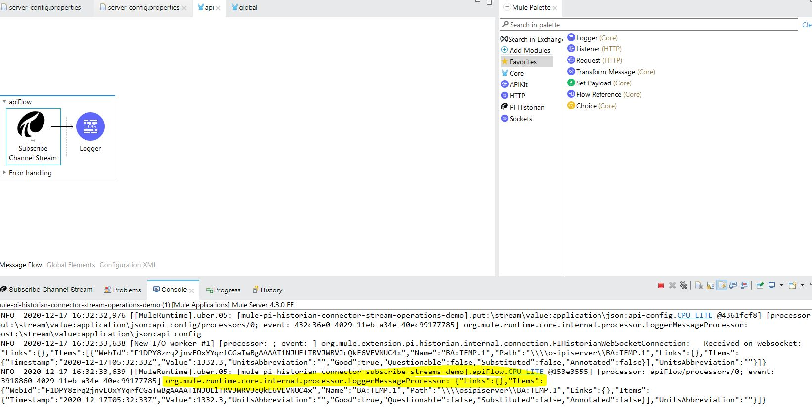

Anypoint Pi Historian Connector Demo
==================================


## INTRODUCTION
------------


This demo provides an application that contains sample flow which subscribes to a stream channel in PI Historian server.

## Operations

   * Subscribe to stream channel.


## Prerequisites
In order to build and run this project, you'll need;
* Java 8
* Anypoint Studio 7.x
* Mule Runtime 4.1.x or higher
* PI Web API 2016 with Basic Auth enabled +


## Import the project

* Go to **File > Import**.
* Select **Anypoint Studio Project from File System** (under the parent folder "Anypoint Studio").
* Provide the root **path to the demo** project folder.
* Select **Mule Runtime (4.1.x EE)** or higher.
* Click **Finish**.
* Set credentials inside the file `src/main/resources/server-config.properties`.

   ```
    pi.server.username=
    pi.server.password=
    pi.server.host=
    pi.server.port=
    
   ```
   
* Open the **Global Element Configuration**.

   
   
* Click the **Test Connection** button to ensure there is connectivity with the sandbox. A successful message should pop-up.

## Run the demo

* Go to **Run > Run As > Mule Application**. .

* Once the application is started, check the console to see the subscription message.



* The application will automatically log the updated values received over the stream channel.




## See more
* For additional technical information on the PiHistorian Connector, visit our [technical reference documentation](TBA).
* For more information on PiHistorian, go to the [PiWeb API site](https://techsupport.osisoft.com/Documentation/PI-Web-API/help.html).
